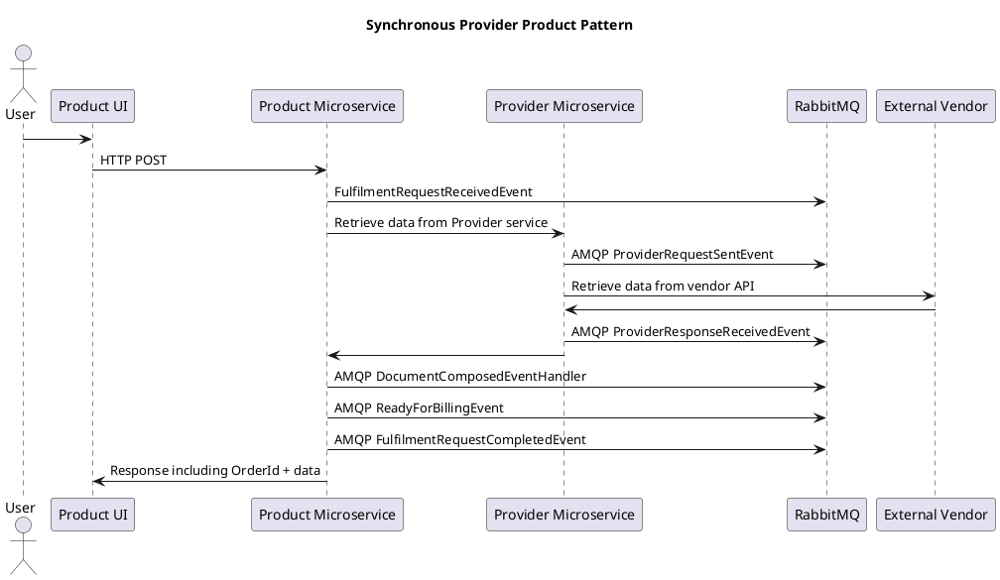
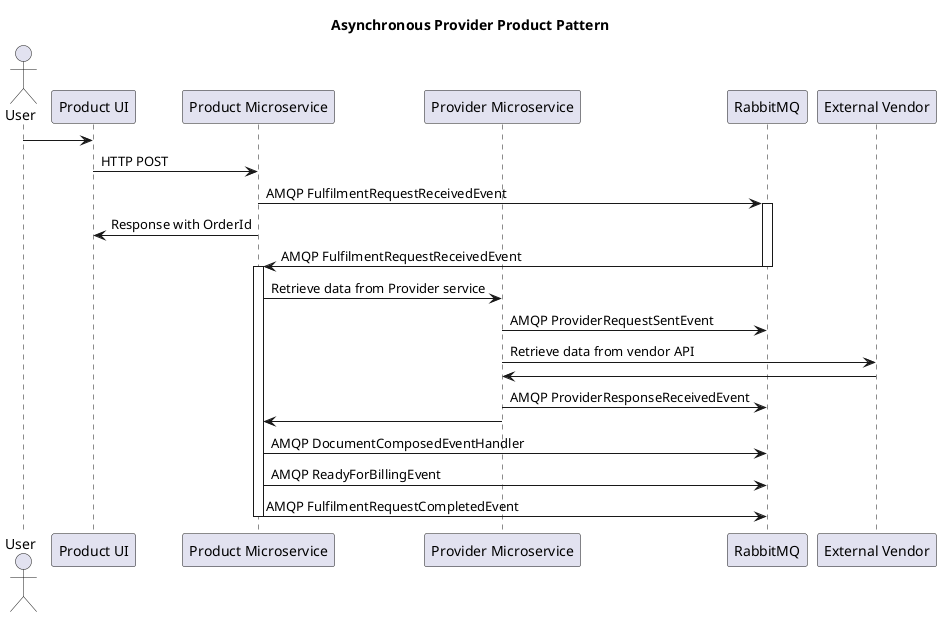

## Introduction

This pattern describes how new products and data sources can be provided to customers by building new components on top of [GSF Core Features list]() (e.g. order management, document provisioning, billing).

When creating a new product, the new components that will be required are:
* __Provider Microservice__: This service communicates with an external authority to procure document data. It is available internally for consumption by Product services.
* __Product Microservice__: This service is responsible for exposing the Product API and orchestrating the product fulfilfment lifecycle, including retrieving data from the provider, rendering a document, and providing order status notifications.
* __Product UI__: Optionally a new product UI (microsite) may be built for the customer to order the product. Without this, products are available only use of the Product API.

The split between the provider and product services provides flexibility and reusability through separation of concerns. A Provider service may be consumed by multiple Product services, each presenting the data in different ways for the customer. Likewise a Product service may reuse data from multiple Provider services to create unique product offerings.

## Message Flows

Following event driven design principles, services emit messages onto the RabbitMQ message bus when noteable events occur allowing interested listeners to handle and action appropriately. This allows services to be decoupled and provides extension points for future functionality. 

Events include:
* __FulfilmentRequestReceivedEvent__: notification that a new order has been received. Handlers include Orderf Fulfilment Manager, for displaying order status to users
* __FulfilmentRequestCompletedEvent__: notification that an order has been completed. Handlers include Order Fulfilment Manager, for displaying order status to users
* __ProviderRequestSentEvent__: notification that a request has been sent by the provider to an external vendor
* __ProviderResponseReceivedEvent__: notification that a response has been received by a provider from an external vendor
* __DocumentComposedEventHandler__: notification thata new document is ready for the user. Handlers include the document management components of GSF Core
* __ReadyForBillingEvent__: notification that a user has performed a billable action. Handlers include the billing management components of GSF Core

### Synchronous vs Asynchronous Fulfilment

In some cases, data and documents can be provided synchronously in response to the initial HTTP request, but in many cases this is not possible. The main reasons include:
* a vendor does not provide a synchronous API
* a response is not guaranteed within an acceptable time for HTTP
* data is too large for a single HTTP request

The flows below show typical patterns for product fulfilment, but individual products and providers may need to combine HTTP and AMQP in different ways to achieve the desired synchronous/asynchronous behaviour.

### Synchronous Fulfilment

### Asynchronous Provider Product Pattern

