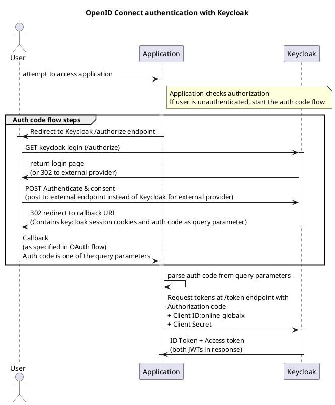
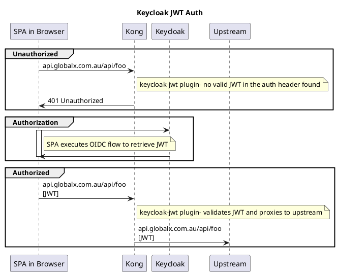

## Introduction

GSF Core provides authentication and authorization services using [Keycloak](), a centralised auth server for account mangement and identity brokering. 


```plantuml
@startuml gsf_core_auth
!include https://raw.githubusercontent.com/plantuml-stdlib/C4-PlantUML/master/C4_Container.puml
!include https://raw.githubusercontent.com/plantuml-stdlib/C4-PlantUML/master/C4_Component.puml

title GSF Core Authentication Container Diagram


System_Boundary(gsf_core, "GSF Core"){
  Container(keycloak, "Keycloak", "Containerised Java application", "Centralised auth platform")
  ContainerDb(keycloak_db, "Keycloak Database", "PostgrSQL")
}

System(search_portal, "Search Manager")
System(unity, "Unity")
System(csm, "CSM")
System(customer, "Customer App")

Rel(search_portal, keycloak, "delegates auth to", "")
Rel(unity, keycloak, "delegates auth to", "")
Rel(csm, keycloak, "delegates auth to", "")
Rel(customer, keycloak, "logs in to", "")

System(customer_A_idp, "Customer A Identity Provider", "e.g. SAML integration to ADFS")
System(customer_B_idp, "Customer B Identity Provider", "e.g. OIDC integration to Azure AD")

Rel(keycloak, keycloak_db, "verifies standard username+password logins against", "")
Rel(keycloak, customer_A_idp, "delegates auth to", "")
Rel(keycloak, customer_B_idp, "delegates auth to", "")

@enduml
```


Instead of each application needing to manage user authentication, an application can delegate authentication to Keycloak using a standard protocol such as OIDC or SAML. Keycloak stores user profiles and can authenticate a user either against credentials stored in the Keycloak database or by delegating to an external Identity Provider. 

Once Keycloak has successfully authenticated a user, it will send a token back to the application representing the user's login.  It is the responsibility of each application to maintain some sort of session and authorize users on on subsequent requests. GSF Core provides some standard tools and patterns that can be reused.

Keycloak stores basic user profile information (username, real name, email address) while application specific information should not be stored in Keycloak, but rather in the application itself. 





## User authorization

Once a user has logged in, there are a number of mechanisms that an application can use to persist that login (i.e. the user should not need to log in over and over again) and manage authorization (i.e. ensuring that the user can access the things they should be able to, and can't access the things they shouldn't be able to).

In order to make these decisions, a system will need to know about user identity and account details. There are a number of ways that these details can be associated with user requests.


For discussion on these mechanisms including tradeoffs and making a choice between them, see:

* https://www.baeldung.com/cs/tokens-vs-sessions
* https://developer.okta.com/blog/2022/02/08/cookies-vs-tokens


### Cookie Auth

After authentication, an application backend creates a cookie for persisting a user session and sends it to the browser. The cookie is stored by the browser and sent along with subsequent requests to the backend. On each request the backend will check for a valid cookie. The most common use is that the cookie contains session id, which maps to a session table in a database containing the full details of the user session. When the application receives a request, it retrieves the sessions id from the cookie, retrieves the session details from the database and makes the appropriate authorization decision.

[Search application's]() use of gxid cookie is an example of cookie auth.

### Token Auth

After authentication, an application front end stores a token that contains contains the full details of the user session. This is often in the form of a [JWT (JSON Web Token)](https://jwt.io/introduction). The token is sent by the application frontend along with every request. The application backend reads and verifies the token, before extracting the details required to make the authorization decision.



[Unity application's]() use of client side JWTs is an example of token auth.


## Single Sign On

Single Sign On is the concept of signing on a single time, and having that session shared transparently whenmoving between systems. This is most often seen in these situations:

### Shared session across all D&D applications

Scenario: As a user, when I log in to one application in the D&D ecosystem I should not need to log in again when I move into a different application in the D&D ecosystem.

This can be achieved by having all applications delegate authentication to keycloak using Auth Code flow. Keycloak maintains a session cookie which is stored on the first login, and subsequent logins from the same or any other application are transparent to the user as keycloak will use the existing session.

### External Identity Provider

Scenario: As a user, I want to be able to log in to a D&D application using my own organisation's authentication mechanism. If I have already logged in to my organisation's authentication I should not need to log in again when visiting a D&D application.

This can be achieved by adding a trusted integration between Keycloak and the external organisation's identity provider. When the user tried to authenticate with keycloak, they will be redirected to the external identity provider using standard protocols such as OIDC or SAML.

See the [Search application's]() use of external Identity Providers for achieving enterprise SSO.

For details on how external identity providers are configured, see [here](https://dyedurhamau.atlassian.net/wiki/spaces/PA/pages/5016196575/Runsheet+for+Configuring+New+SSO+Customers+non-technical).

## Caveats

In theory each application is independent, with keycloak being the central source of truth for user accounts, but in practice there are some dependencies as the auth systems have evolved over time. Here are some things to note:

* Many GSF Core services are coupled with [Search application authentication and user management](). This includes billing, document storage, order management and access to purchasing products. While a user can successfully log on to an application such as [Unity]()) by having just the user account in Keycloak, in order to use these core services there must also be an equivalent user set up in the Search system.

