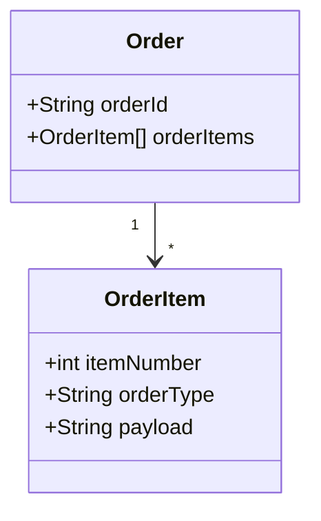
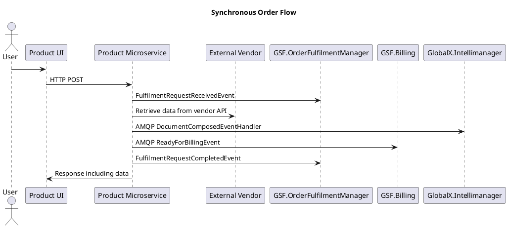
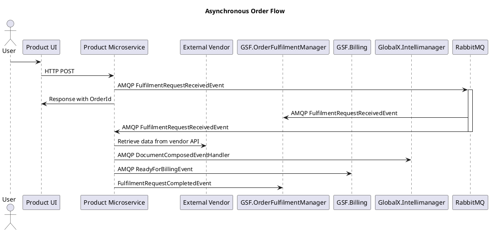
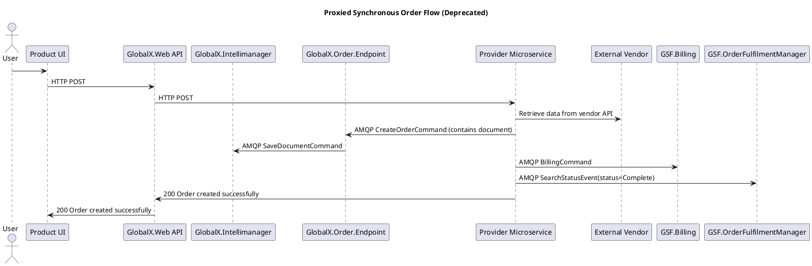
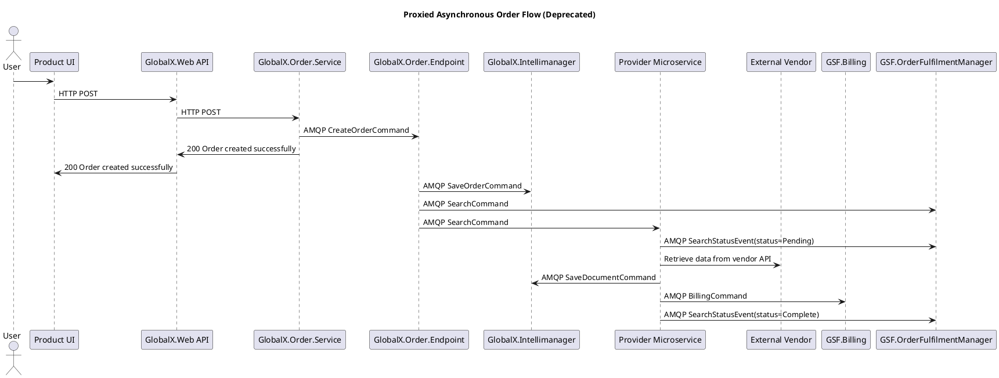

## Introduction

* Customers acquire data, documents and services by submitting an Order for a Product
* Different types of products are fulfilled by the appropriate Product microservice. These Product microservices publish order status information during the fulfilment process
* Order fulfilment status is tracked by the OFM (Order Fulfilment Manager) microservice (GSF.OrderFulfilmentManager). Users can interact with OFM data through:
  * OFM UI: This application is for use by internal staff, for handling customer enquiries and manually performing fulfilment actions
  * Order Manager UI: This application is for use by customers, to view their orders and the associated documents and billing details


```plantuml
@startuml gsf_core_auth
!include https://raw.githubusercontent.com/plantuml-stdlib/C4-PlantUML/master/C4_Container.puml
!include https://raw.githubusercontent.com/plantuml-stdlib/C4-PlantUML/master/C4_Component.puml

title GSF Core Order Management Container Diagram

Person(person_user, "Our Customer")
Person(person_internal_user, "Internal staff")
System(search_app, "Search application")
System(unity_app, "Unity application")


System_Boundary(c1, "Order Management"){
    Container(GSF_OrderFulfilmentManager_Endpoint, "GSF.OrderFulfilmentManager.Endpoint", "C# Microservice", "Provides APIs for retrieving order status information")
    Container(gsf_orderfulfilmentmanager_ui, "gsf.orderfulfilmentmanager.ui", "Angular Microsite", "UI for internal staff to interact with customer orders")
    Container(GSF_OrderManager_UI, "GSF.OrderManager.UI", "Angular SPA", "UI for customers to interact with their own orders")
}

Rel(person_user, GSF_OrderManager_UI, "Views personal order data", "")
Rel(person_internal_user, gsf_orderfulfilmentmanager_ui, "Views customer order data", "")
Rel(GSF_OrderManager_UI, GSF_OrderFulfilmentManager_Endpoint, "Reads order data from", "")
Rel(gsf_orderfulfilmentmanager_ui, GSF_OrderFulfilmentManager_Endpoint, "Reads order data from", "")

Rel(person_user, search_app, "Acquire products using", "")
Rel(person_user, unity_app, "Acquire products using", "")
Rel(search_app, GSF_OrderFulfilmentManager_Endpoint, "sends order data to", "")
Rel(unity_app, GSF_OrderFulfilmentManager_Endpoint, "sends order data to", "")


@enduml
```

### Anatomy of an Order

An order contains multiple order items. Generally each order item is for one type of [product](), stored in the orderType value.  Generally each order item results in the delivery of some [documents]() and [billing items]().



## Order fulfilment flows

### Standard flows

These message flows enable product UIs and integrators to submit orders via HTTP APIs. See also [Provider-Product Pattern]().

The Synchronous Order Flow is used for ordering products synchronously i.e. the response to the order creation request contains the final data or document. This is used when the vendor makes the data available sycnhronously and the application wishes to display it to the user immediately following order creation.



The Asynchronous Order Flow is used for ordering products asynchronously i.e. the response to the order creation request does not contain the final data or document, and instead the results must be retrieved at a later date from the appropriate API. This is used either when the application does not require the data immediately after order creation, or for certain products which are retrieved from the vendor asycnhronously in a process which could potentially take weeks.



### Proxied flows

These Proxied flows achieve the same synchronous and asynchronous functinality described above, but have the order proxied via GlobalX.Web and the GlobalX.Order service. Since the introduction of an API Gateway into the GSF request flow, this mechanism is deprecated but is included for reference as it is widely used by existing products.




