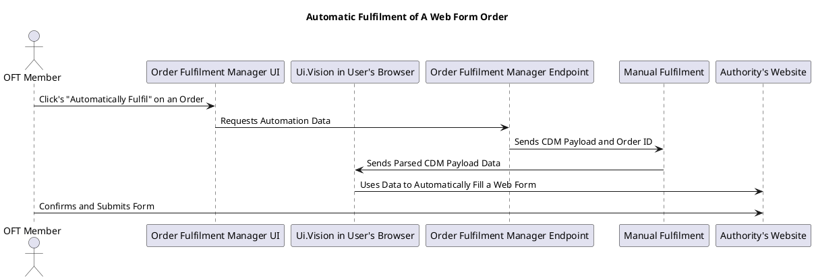

|Quick Links||
|---|---|
|Repo|[ManualFulfilment](https://bitbucket.globalx.com.au/projects/GSF/repos/manualfulfilment/browse)|
|TeamCity|[ManualFulfilment](https://teamcity.globalx.com.au/project/Gsf_ManualFulfilment)|
|K8s Deployment|[manual-fulfilment](https://console.cloud.google.com/kubernetes/deployment/australia-southeast1/dev-k8s/gsf-services/manual-fulfilment/)|
|URL (Prod)|https://ingress.production.globalx.com.au/api/internal/manual-fulfilment|

## Summary
Manual Fulfilment provides functionality to support the manual fulfilment of orders by the Order Fulfilment Team (OFT).\
This includes billing, as well as tools to help with certificate automation.\
It is intended to take over vital functionality from [GSF.Provider.Ess.Qld.Endpoint](https://bitbucket.globalx.com.au/projects/GSF/repos/gsf.provider.ess.qld.endpoint/browse).

## Services

### OrderDataParsingService
This service receives a CDM Payload and parses it into a format that can be used by our UI.Vision Macros and PdfFormFillingService to automatically fill Web Forms and PDFs.\
Information on how UI.Vision is set up ca be found [here](https://dyedurhamau.atlassian.net/wiki/spaces/NPI/pages/10400333843/How+to+set+up+a+certificate+with+Web+Form+automation).

