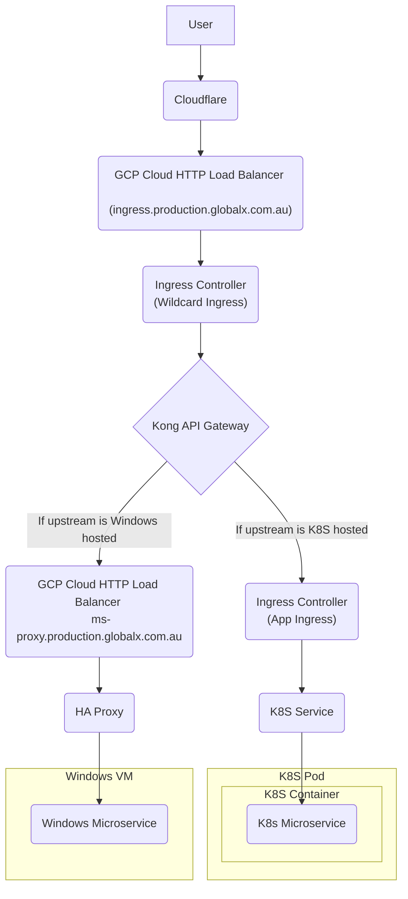

## Components

This diagam shows the key components and how they are deployed.



## Request Flow

This diagram shows conceptually how data flows through these key components.

```mermaid
graph TD

CF(Cloudflare)
LBIngress("GCP Cloud HTTP Load Balancer <br /> (ingress.production.globalx.com.au)")
IngressWC("Ingress Controller <br /> (Wildcard Ingress)")
Kong{Kong API Gateway}
IngressApp("Ingress Controller <br /> (App Ingress)")

KSvc(K8S Service)
KApp(K8s Microservice)
LBHap(GCP Cloud HTTP Load Balancer <br /> ms-proxy.production.globalx.com.au)
HAP(HA Proxy)
WApp(Windows Microservice)


User --> CF
CF --> LBIngress
LBIngress --> IngressWC
IngressWC --> Kong

Kong -->|If upstream is K8S hosted| IngressApp
IngressApp --> KSvc
KSvc --> KApp
subgraph "K8S Pod"
  subgraph "K8S Container"
    KApp
  end
end

Kong -->|If upstream is Windows hosted| LBHap
LBHap --> HAP
HAP --> WApp

subgraph "Windows VM"
WApp
end

```

