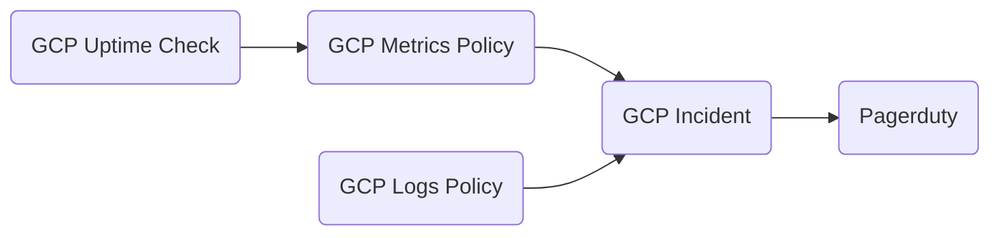

## Alerts and Notifications

GCP provides tools for monitoring application status and logs, and generates incidents when unhealthy conditions are encountered. Pagerduty is used to send alert notifications to the on call team. An integration is set up between Google Cloud and Pagerduty, so all GCP alerts trigger a Pagerduty incident.

### GCP Monitoring Concepts

GCP Logs Policy
* Raises an incident based on the presence of a particular message in the logs

GCP Metrics policy
* Creates an incident based on some metric hitting a defined value. This could 

GCP Uptime Check
* Creates a metric for the availabliity of a service. All services and applications should have Google Uptime checks added. An uptime check hits a predefined URL, and when some success cireteria is not met it will rtaise an alert. These are currently manually added via the Google Cloud Console

Links:
* GCP Production Monitoring: https://console.cloud.google.com/monitoring/uptime?project=glx-production-au
* Pagerduty: https://dyedurhamaustralia.pagerduty.com/incidents

## Prometheus/Grafana stack

Prometheus and Grafana are used for collecting and visualising application data. These [components](https://bitbucket.globalx.com.au/projects/CLD/repos/flux-gsf/browse/infrastructure/base/kube-prometheus-stack), and the [Grafana dashboards](https://bitbucket.globalx.com.au/projects/CLD/repos/flux-gsf/browse/infrastructure/base/kube-prometheus-resources/dashboards) for a number of applications, are deployed via GitOps.
