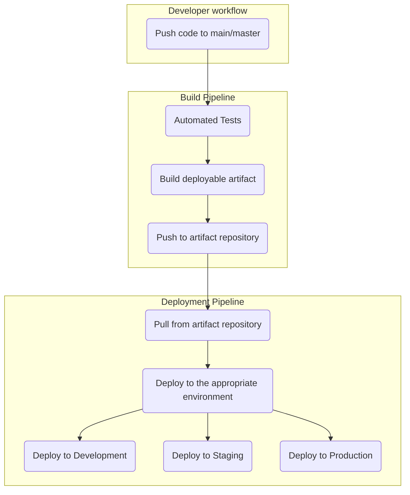
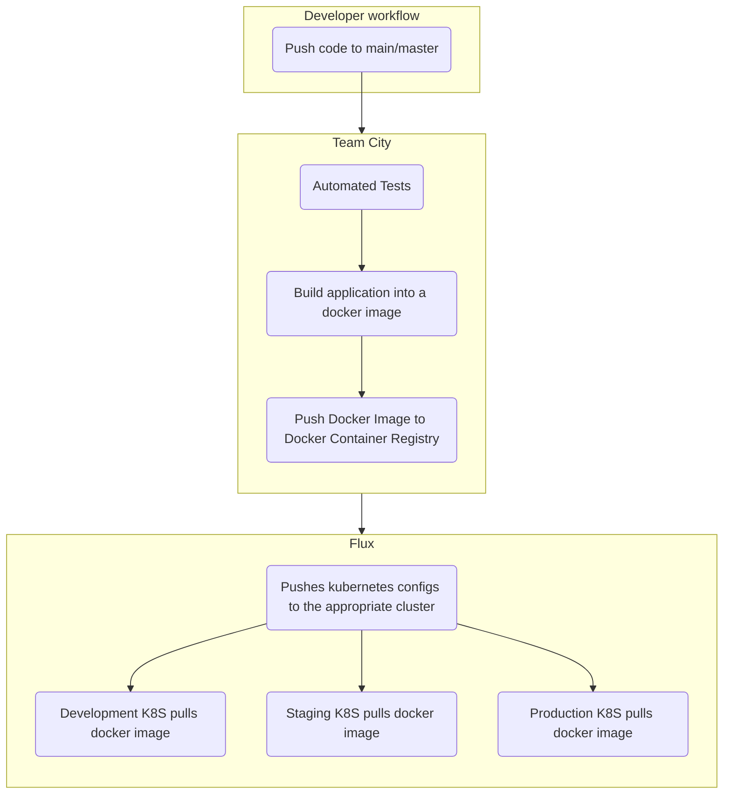
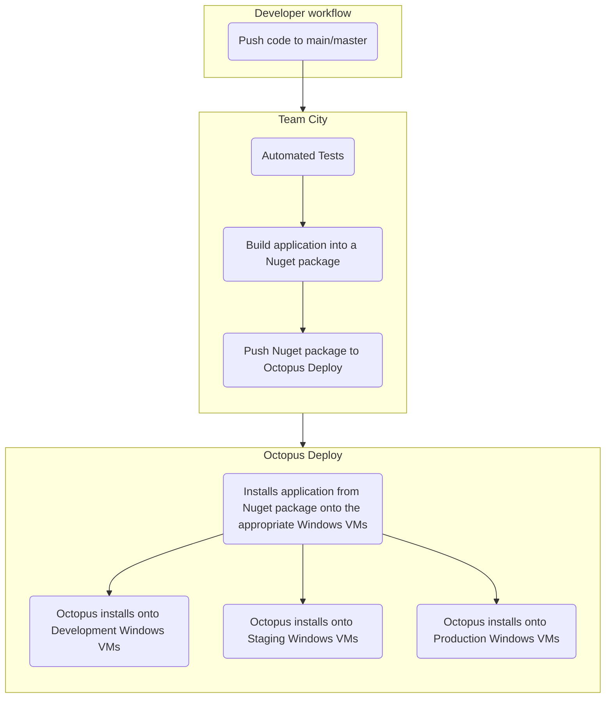

## CI/CD Overview

CI/CD pipelines differ for Kubernetes and Windows applications, but they follow the same general pattern.

## CI/CD for Kubernetes hosted applications

* Applications are built and packaged by Team City
* Artifacts are Docker Images, pushed to the Docker Container Registry
* Flux is responsible for deployment, using the [GitOps pattern](../3-gitops/)

## CI/CD for Windows hosted applications

* Applications are built and packaged by Team City
* Artifacts are Nuget packages, pushed to Octopus
* Octopus is responsible for deployment

