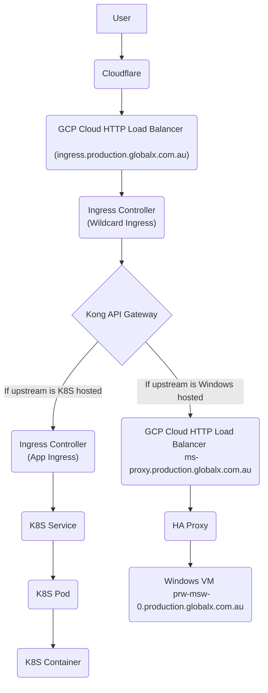

Key facts:

* The GSF platform is hosted in Google Cloud.

*There are 3 environments- Development, Staging, Production- each with their own GCP Projects. The goal is to have all environments mirrored as much as possible.

* There are broadly 2 categories of GSF applications based on how they are hosted- Kubernetes hosted applications and Windows applications. All new application development is done in the Kubernetes pattern, while we migrate and maintain the Windows hosted applications.

## Infrastructure Components

This diagram highlights the key Google Cloud infrastructural components that are used for the GSF2 platform.



## Deployment Diagram

The following diagrams show how traffic is routed through the platform to the applications. 

The first shows the key components and how they are deployed.



The second shows conceptually how data flows through these components.

## DevOps Components

TODO: overview of glx-devops-au environment and ci/cd tools