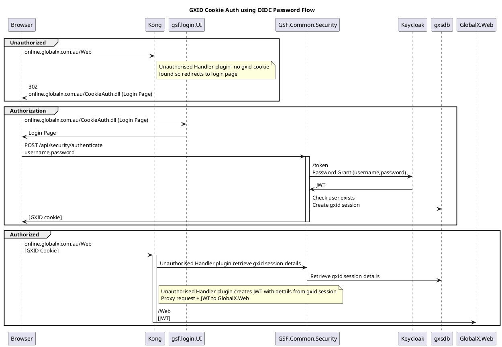
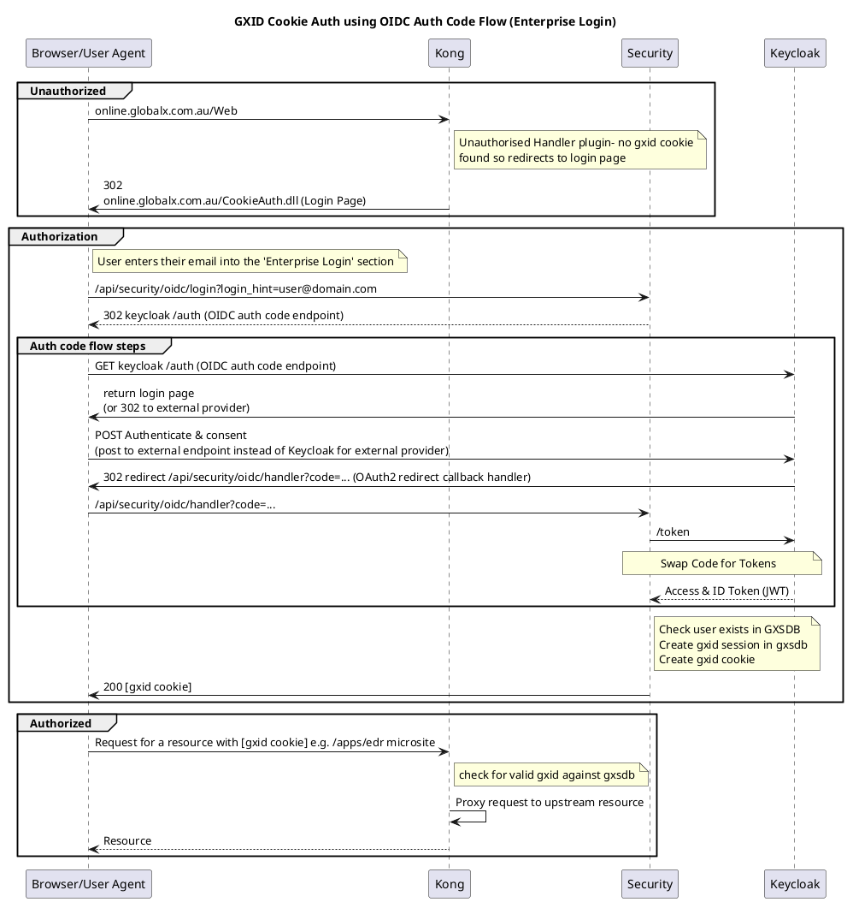

## GXID Cookies

All UIs and many APIs in the Search application are protected using gxid cookie auth.

GXID (GlobalX ID) is a unique token that identifies a user session. When using a gxid auth flow, a user is assigned a gxid after authenticating. The gxid is the key to the session stored in the GXSDB sessions table. A common use of the GXID is for the client to include it in a cookie in subsequent requests. GlobalX services can then validate the user session and retrieve the associated user and user details.

In most cases, microservices don't need to know about GXID but instead can rely on a JWT being present in the request. Gxid authorization is done at the API gateway level (Kong), and Kong converts the GXID into a JWT. This means our microservices can be OAUTH2 compatible, where the user explicitly provides the JWT rather than the GXID.

### GXID Cookie using Password Flow

In this flow, the login microsite collects the username and password from the user and verifies with keycloak using the Password Flow.

### GXID Cookie using SSO

In this flow, the application uses the OIDC Auth Code flow to redirect the user to keycloak for authentication. Keycloak then further redirects the user to the target external identity provider using a standard SSO protocol such as OIDC or SAML. In this example, the unauthenticated user is redirected to the login page, which initiates the OIDC Auth Code flow.

## Identity Server JWT

## Kong API Keys