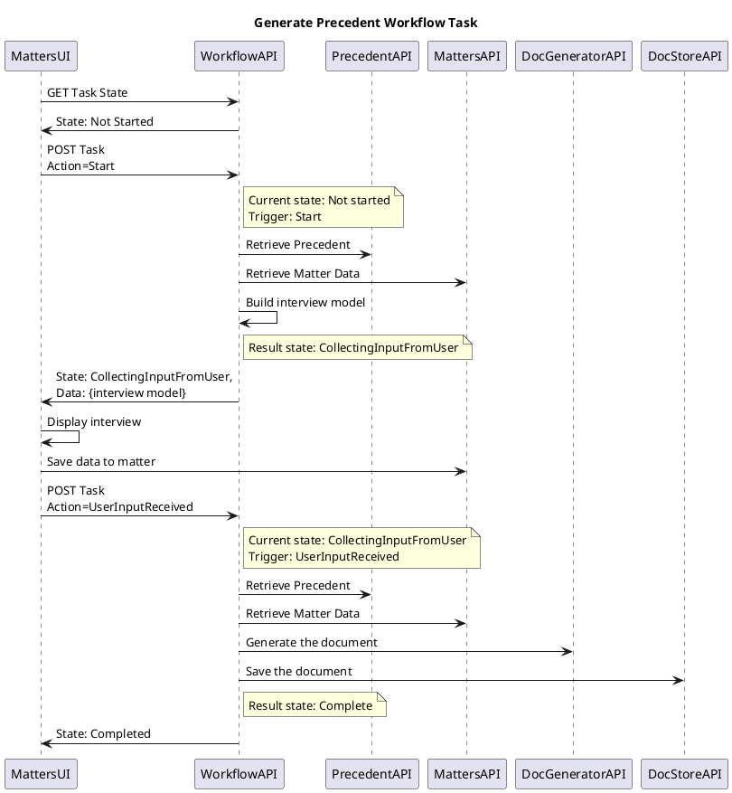
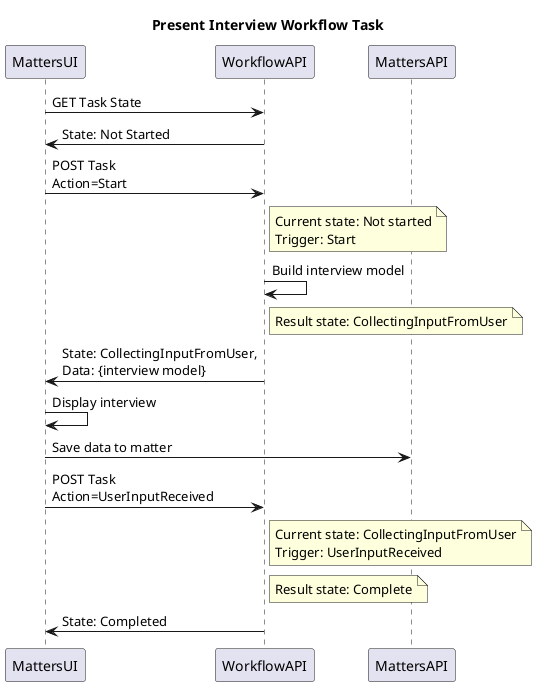

```plantuml
@startuml

title Generate Precedent Workflow Task

MattersUI -> WorkflowAPI: GET Task State
WorkflowAPI -> MattersUI: State: Not Started
MattersUI -> WorkflowAPI: POST Task\nAction=Start
note right of WorkflowAPI:Current state: Not started\nTrigger: Start
WorkflowAPI -> PrecedentAPI: Retrieve Precedent
WorkflowAPI -> MattersAPI: Retrieve Matter Data
WorkflowAPI -> WorkflowAPI: Build interview model
note right of WorkflowAPI:Result state: CollectingInputFromUser
WorkflowAPI -> MattersUI : State: CollectingInputFromUser,\nData: {interview model}
MattersUI -> MattersUI: Display interview
MattersUI -> MattersAPI: Save data to matter
MattersUI -> WorkflowAPI: POST Task\nAction=UserInputReceived
note right of WorkflowAPI:Current state: CollectingInputFromUser\nTrigger: UserInputReceived
WorkflowAPI -> PrecedentAPI: Retrieve Precedent
WorkflowAPI -> MattersAPI: Retrieve Matter Data
WorkflowAPI -> DocGeneratorAPI: Generate the document
WorkflowAPI -> DocStoreAPI: Save the document
note right of WorkflowAPI:Result state: Complete
WorkflowAPI -> MattersUI: State: Completed

@enduml
```

```plantuml
@startuml

title Present Interview Workflow Task

MattersUI -> WorkflowAPI: GET Task State
WorkflowAPI -> MattersUI: State: Not Started
MattersUI -> WorkflowAPI: POST Task\nAction=Start
note right of WorkflowAPI:Current state: Not started\nTrigger: Start
WorkflowAPI -> WorkflowAPI: Build interview model
note right of WorkflowAPI:Result state: CollectingInputFromUser
WorkflowAPI -> MattersUI : State: CollectingInputFromUser,\nData: {interview model}
MattersUI -> MattersUI: Display interview
MattersUI -> MattersAPI: Save data to matter
MattersUI -> WorkflowAPI: POST Task\nAction=UserInputReceived
note right of WorkflowAPI:Current state: CollectingInputFromUser\nTrigger: UserInputReceived
note right of WorkflowAPI:Result state: Complete
WorkflowAPI -> MattersUI: State: Completed

@enduml
```