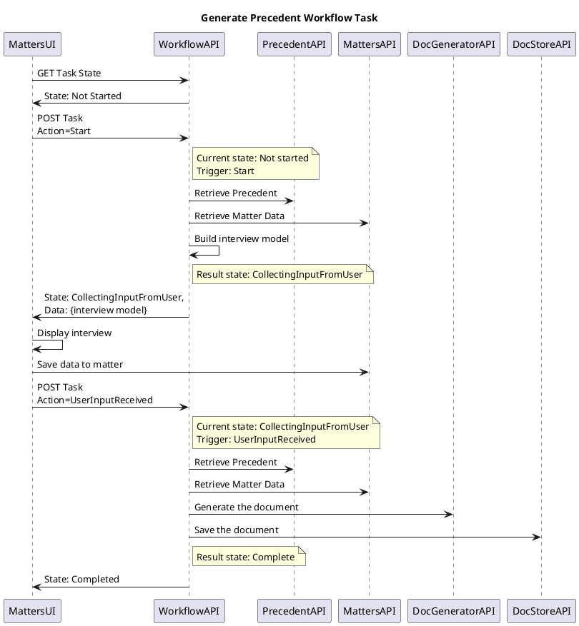
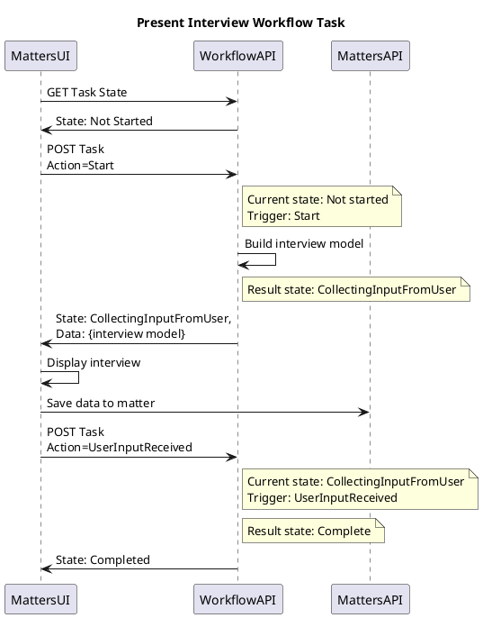

# Rationale

Workflow captures the the tasks that a user must execute and the business processes that they follow to complete a unit of work.

The guiding principles behind Workflow are:
* Dynamic & reactive- guide the user through their work, not just a simple task list
* Customisable- rather than business rules being built into the product core, workflows can be defined and uploaded into the system. This allows customisation by users and scalability into different areas of law
* Automation- tasks are not just reminders to perform an action, but will integrate into the product and other systems via APIs e.g. document generation, Property Information APIs

{}
Migrate these diagrams out of Miro ('Unity Core Designs') and into diagrams-as-code
https://miro.com/app/board/o9J_lq7M_yQ=/?moveToWidget=3458764525108145646&cot=14
{}



# Concepts

Each type of workflow is defined by a Workflow Template. A Workflow Template applies to one or more types of Matter. When a new matter is created, an instance of the appropriate Workflow will be created. Workflows are composed of Tasks. Each Task includes some type of activity (Task Type), and the dynamic interactions between tasks (Task Behaviour). 

Each kind of Task Type and Task Behaviour is built once in code by developers (C#, in GSF.Workflow microservice), and can be reused and configured in multiple workflows through the Workflow toolkit. Currently an API, eventually a workflow editor UI. 



## Reactive Workflow

{}
See diagram 'Workflow- Task Behaviours' on Miro 'Unity Core Designs'
https://miro.com/app/board/o9J_lq7M_yQ=/?moveToWidget=3074457366187919307&cot=14
{}

The user's dashboard shows the current Actionable tasks. Task Actionability is driven by Due Data- if a task has a Due Date, it is Actionable. A reactive workflow is achieved by configuring Behaviours that manipulate the Due Date of tasks in reaction to changes on the matter (events). Behaviours therefor capture business processes and flow control.  

These matter events include: 
* Matter Creation
* Task Status updated- react to a task being started/completed 
* Matter Data Update- react to the user updated some data e.g. settlement date 

Examples: 
* When the Matter is created, Task A is immediately Actionable
* When Task A is complete, Task B & C become Actionable 
* When Task A is complete, Task B becomes Actionable if the matter has data X, but Task C becomes Actionable if the matter has data Y
* When the user changes data from X to Y, Task B due date is updated
* When the user changes data from X to Y, Task B is no longer Actionable and Task C is Actionable 

The goal is to make a Guided Workflow i.e. the user's dashboard shows the current Actionable tasks, but this is not enforced and users are able to action other tasks if they wish.  Enforced workflows/locking down workflow/fine grained permissions on workflow is not yet available. 

## Smart Tasks

{}
See diagram 'Workflow- Task State Management' on Miro 'Unity Core Designs'
https://miro.com/app/board/o9J_lq7M_yQ=/?moveToWidget=3458764532442514883&cot=14
{}

A Task Type is defined in code. It is not a simple To Do list item, but can have state and perform actions.

